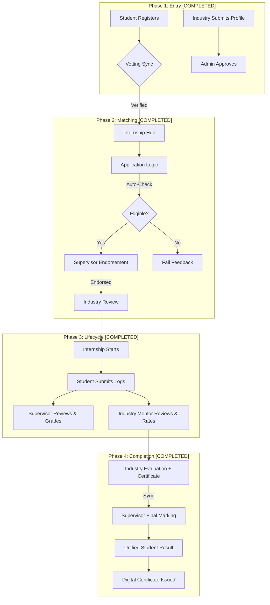

# 🌊 Internship Management System: Complete Flow & Architecture

This document provides a deep dive into the **IMS ecosystem**, explaining exactly how data flows, how roles interact, and the technical concepts behind the "Premium" experience.

---

## 🏗️ 1. High-Level Architecture (The Engine)

The project follows a **MERN Stack** (MongoDB, Express, React, Node) architecture, but with a heavy focus on **Design Consistency** and **Automated Vetting**.

### **Frontend Anatomy**
- **Vite + React**: The core UI engine. Faster builds and modern JSX syntax.
- **Tailwind CSS**: Used for the entire design system. We use a custom palette (`primary-600` Indigo) and typography (`Inter` & `Outfit`).
- **Layout System**: Every role has a specific "Shell" (`StudentLayout`, `AdminLayout`, etc.) that wraps the content.
- **Navigation Enhancements**: 
    - `LoadingBar.jsx`: A top progress bar for smooth transitions.
    - `ScrollToTop.jsx`: Automatically resets page position on every route change.

### **Backend Anatomy**
- **Node/Express**: Handles RESTful API requests.
- **Role-Based Middlewares**: Ensures that a Student cannot access Admin routes.
- **MongoDB**: Stores user profiles, internship posts, and academic logs as linked documents.

---

## 👥 2. Role-Based "User Journeys" [STATUS: COMPLETED]

### **A. The Student Flow**
1. **Registration**: Student signs up with their academic details (CGPA, Department).
2. **Browsing**: Enters the **Internship Hub** to see all active postings.
3. **Application**: The system runs a **Pre-Vetting Check** on CGPA and eligibility.
4. **Tracking**: Once hired, the student's dashboard shows a **Progression Bar** (e.g., 75% complete).
5. **Reporting**: Submits **Weekly Logs** which are instantly visible to their mentors.
6. **Graduation**: Views final results and downloads the **Digital Certificate** from the "My Certifications" portal.

### **B. The Industry Flow**
1. **Onboarding**: Submits company profile for **Admin Approval**.
2. **Posting**: Creates a "Node" (Job Post) with specific requirements.
3. **Vetting**: Reviews student applications, certificates, and CVs once endorsed by a supervisor.
4. **Action**: Hires or Rejects students.
5. **Evaluation**: Provides professional feedback and uploads the **Completion Certificate** at the end of the internship.

### **C. The Supervisor Flow**
1. **Monitoring**: Sees a list of all students assigned to them in the **Registry**.
2. **Reviewing**: Reads students' weekly logs to ensure they are learning relevant skills.
3. **Site Visits**: Schedules a physical visit to the company to verify the student's progress.
4. **Grading**: Finalizes academic marks based on logs and **Auto-Synced Industry Feedback**.

### **D. The Root Admin Flow**
1. **System Health**: Monitors CPU load, DB consistency, and "Telemetry" via the Dashboard.
2. **User Management**: Full control to edit, block, or delete any user role.
3. **Industry Vetting**: Approves new companies to join the platform.

---

## 🔄 3. System Visualization (The Lifecycle)

---

## 🧪 4. End-to-End Professional Flow (Testing Steps)

Use this sequence to verify the **Full Professional Lifecycle**:

### Phase 1: Identity & Setup
*   **Admins**: Approve Industry Partners in the "Verify Industry" portal.
*   **Industry**: Post an internship once approved.

### Phase 2: The Placement Journey
1.  **Student**: Apply to an internship from the **Hub**.
2.  **Supervisor**: Go to **Pending Applications** -> **ENDORSE** (Academic Vetting).
3.  **Industry**: Go to **Applicants** -> View Endorsed Candidates -> **HIRE/SELECT**.

### Phase 3: Monitoring & Lifecycle
1.  **Student**: Submit **Weekly Logs** documenting activities and learning.
2.  **Industry**: Visit **Log Monitoring** -> View student logs -> **Rate / Review** (Professional Feedback).
3.  **Supervisor**: Visit **Student Logs** -> Review & Give academic marks.
4.  **Industry**: Once duration ends, visit **Evaluations** -> Submit a `Final` period evaluation and **Upload Certificate**.
3.  **Supervisor**: Visit **Final Marking** -> Select Student. (Industry GPA and feedback are now **Auto-Synced**). Submit final academic marks.
4.  **Student**: Visit **Results** to see the unified grade card and visit **Certifications** to find the issued certificate.

---

## 🎨 5. Design Concepts (Premium UI)

1. **Glassmorphism**: Using `backdrop-blur-md` for panels to give a modern, depth-filled feel.
2. **Micro-Animations**: `hover:rotate-12` on icons and `animate-fade-in` on layout transitions.
3. **Visual Consistency**: Uniform spacing standards (`space-y-10`) and "Pill" headers for role identification.
4. **Zero-Lag UI**: Integrated `LoadingBar` and `ScrollToTop` for a seamless SPA experience.

---

© 2026 Academic Internship Management System (IMS). A bridge between University and Industry.
