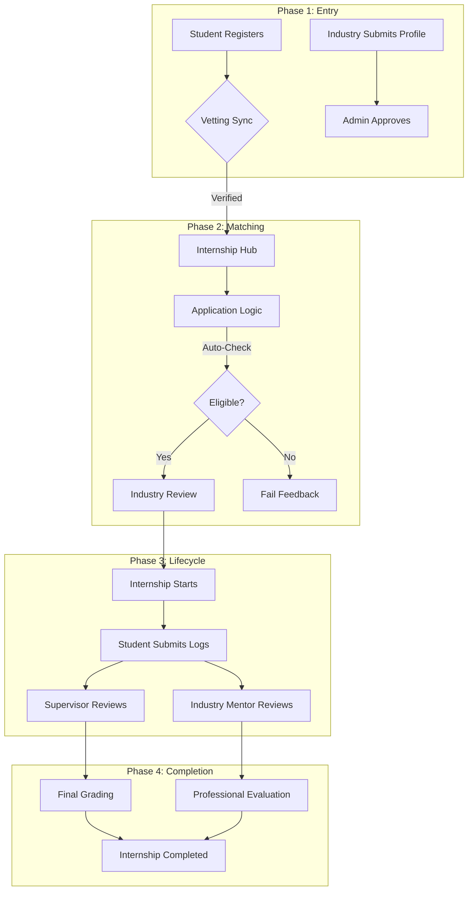

# 🌊 Internship Management System: Complete Flow & Architecture

This document provides a deep dive into the **IMS ecosystem**, explaining exactly how data flows, how roles interact, and the technical concepts behind the "Premium" experience.

---

## 🏗️ 1. High-Level Architecture (The Engine)

The project follows a **MERN Stack** (MongoDB, Express, React, Node) architecture, but with a heavy focus on **Design Consistency** and **Automated Vetting**.

### **Frontend Anatomy**
- **Vite + React**: The core UI engine. Faster builds and modern JSX syntax.
- **Tailwind CSS**: Used for the entire design system. We use a custom palette (`primary-600` Indigo) and typography (`Inter` & `Outfit`).
- **Layout System**: Every role has a specific "Shell" (`StudentLayout`, `AdminLayout`, etc.) that wraps the content.
- **Navigation Enhancements**: 
    - `LoadingBar.jsx`: A top progress bar for smooth transitions.
    - `ScrollToTop.jsx`: Automatically resets page position on every route change.

### **Backend Anatomy**
- **Node/Express**: Handles RESTful API requests.
- **Role-Based Middlewares**: Ensures that a Student cannot access Admin routes.
- **MongoDB**: Stores user profiles, internship posts, and academic logs as linked documents.

---

## 👥 2. Role-Based "User Journeys"

There are **4 distinct flows** in the project. Here is how they work:

### **A. The Student Flow (The Applicant)**
1. **Registration**: Student signs up with their academic details (CGPA, Department).
2. **Browsing**: Enters the **Internship Hub** to see all active postings.
3. **Application**: The system runs a **Pre-Vetting Check**:
    - *If (Student.CGPA >= Requirement.MinCGPA)* -> Forward application.
    - *If (Failed Courses == 0)* -> Forward application.
4. **Tracking**: Once hired, the student's dashboard shows a **Progression Bar** (e.g., 75% complete).
5. **Reporting**: Submits **Weekly Logs** which are instantly visible to their mentors.

### **B. The Industry Flow (The Provider)**
1. **Onboarding**: Submits company profile for **Admin Approval**.
2. **Posting**: Creates a "Node" (Job Post) with specific requirements.
3. **Vetting**: Reviews student applications, certificates, and CVs.
4. **Action**: Hires or Rejects students.
5. **Evaluation**: Provides professional feedback at the end of the internship.

### **C. The Supervisor Flow (The Academic Monitor)**
1. **Monitoring**: Sees a list of all students assigned to them in the **Registry**.
2. **Reviewing**: Reads students' weekly logs to ensure they are learning relevant skills.
3. **Site Visits**: Schedules a physical visit to the company to verify the student is actually there.
4. **Grading**: Finalizes the academic marks based on logs and industry feedback.

### **D. The Root Admin Flow (The Controller)**
1. **System Health**: Monitors CPU load, DB consistency, and "Telemetry" via the Dashboard.
2. **User Management**: Can edit, block, or delete any user role.
3. **Industry Vetting**: The "Gatekeeper" who approves new companies to join the platform.

---

## 🔄 3. System Visualization (The Flowchart)

---

## 🎨 4. Design Concepts (Why it feels "Premium")

We used specific concepts to make this more than just a regular portal:

1. **Glassmorphism**: Using `bg-white/80` and `backdrop-blur-md` for panels to give a modern, depth-filled feel.
2. **Micro-Animations**: 
    - `hover:rotate-12` on icons to make them feel playful.
    - `animate-fade-in` on every page load for a smooth entrance.
    - `hover:-translate-y-1` on cards to indicate interactivity.
3. **Visual Consistency**:
    - **Uniform Spacing**: `space-y-10` and `pb-12` are global standards.
    - **Header Logic**: Dashboard headers use "Pill" labels (e.g., "Student Portal") for instant role identification.
4. **The "Lack-Free" UI**:
    - By using `LoadingBar` and `ScrollToTop`, we eliminate the "jumpiness" usually felt in single-page applications.

---

## 📂 5. Key File Structure

- `/client/src/App.jsx`: The **Routing Center**. Defines every role's access path.
- `/client/src/components/layout/`: Holds the **Shells** for each user role.
- `/client/src/pages/dashboard/`: Contains the **Command Centers** for all 4 roles.
- `/client/src/pages/hub/`: The main internship browsing logic.
- `/client/src/index.css`: The **Design Tokens** (Colors, Shadows, Custom Scrollbars).

---

© 2026 Academic Internship Management System (IMS). A bridge between University and Industry.
