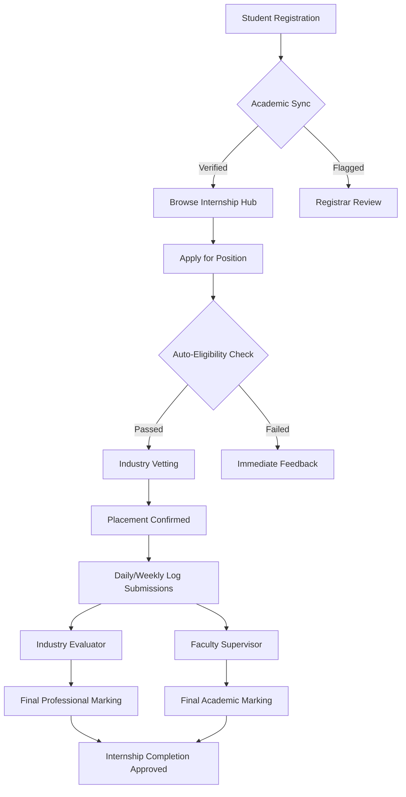

# 🎓 Academic Internship Management System (IMS)

A **Premium, Enterprise-Grade** platform designed to orchestrate the entire internship lifecycle. From automated academic vetting to real-time industrial monitoring, IMS bridge the gap between **Academia** and **Industry** with a sophisticated, role-based ecosystem.

---

## 🏛️ What We Solve

Traditional internship management is often fragmented, relying on manual emails and physical logs. **IMS** eliminates these bottlenecks:

- **Eradicate Manual Vetting**: Automated eligibility checks (CGPA, Course pre-reqs) ensure only qualified candidates apply.
- **Transparency Vacuum**: Real-time dashboards provide live "telemetry" on student progress for both Industry Mentors and Academic Supervisors.
- **Onboarding Friction**: Secure, admin-vetted registration for Industry Partners prevents fraudulent postings and ensures high-quality placements.
- **The "Lost Log" Problem**: Digital daily/weekly logs with secure academic oversight prevent data loss and ensure consistent reporting.

---

## 👥 The Ecosystem (Role-Based)

The system is architected around four distinct "Nodes," each with a specialized Premium Dashboard.

### 👤 Student Node
- **Browse Hub**: Global search and filter for verified internship openings.
- **Progression Track**: Real-time visual tracking of internship completion percentage.
- **Log Management**: Digital submission of weekly tasks and professional reflections.

### 🏢 Industry Node
- **Command Center**: Manage corporate talent pipelines and vet applicants.
- **Node Management**: Professional CRUD for internship postings with custom vetting criteria.
- **Talent Analytics**: Monitor intern performance and provide professional evaluative feedback.

### 🎓 Supervisor Node
- **Academic Oversight**: Monitor assigned student nodes across various organizations.
- **Log Compliance**: Review and verify technical reflections and task progress.
- **Site Visits**: Structured scheduler for physical on-site professional evaluations.

### 🛡️ Root Admin Node
- **Global Control**: Full oversight of system telemetry and user management.
- **Vetting Hub**: Manual verification of Industry Partners to ensure platform integrity.
- **Data Integrity**: Global reporting and system-wide configuration management.

---

## 🛠️ Technology Stack

### **Frontend (The Experience Nodes)**
- **Core**: React 18 with Vite (Ultra-fast HMR)
- **Styling**: Tailwind CSS (Custom Design System with `Inter` & `Outfit` typography)
- **Interactions**: Lucide Icons, Custom Micro-animations, and Glassmorphism.
- **Navigation**: Global `ScrollToTop` behavior and a **Premium Top-Loading Bar**.
- **State**: Redux Toolkit for unified global state management.

### **Backend (The Logic Engine)**
- **Runtime**: Node.js & Express.js
- **Database**: MongoDB (NoSQL) for flexible schema nodes.
- **Security**: JWT-based Authentication, Bcrypt encryption, and Role-Based Access Control (RBAC).

---

## 🔄 Project Flow

---

## ✨ Premium Aesthetics

The IMS portal isn't just a tool; it's a **Premium Experience**. 
- **Brand Language**: Consistent `primary-600` (Indigo) and `slate-900` palette.
- **Interaction Synergy**: Hover rotations, scale-ins, and smooth transitions on every clickable node.
- **Visual Telemetry**: Real-time progress bars and status indicators that feel "alive."

---

© 2026 Academic Internship Management System (IMS). Crafted for Professional Excellence.